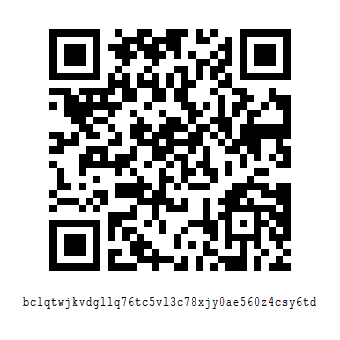

# 寄付・献金/Donation
Copyright (C) 2020-2023 Yigty.ORG; all rights reserved.
Copyright (C) 2020-2023 Takym.

## 概要
* Yigty.ORG への寄付にご興味を持って頂きありがとうございます。
* 開発費及び開発者の生活費の為に[募金](#脚注)しております。
* Thank you for your interest in donating to Yigty.ORG!
* We are collecting donations to cover developing costs and living expenses.

## Yigty.ORG 宛に寄付・献金する（Donate to Yigty.ORG）
只今準備中です。気長にお待ちください。
尚、現在の Yigty.ORG の構成員は Takym のみです。

Now preparing...... Please wait patiently.
Furthermore, the current Yigty.ORG member is only Takym.

## [@Takym](https://github.com/Takym) 宛に寄付・献金する（Donate to Takym）
Bitcoin または Monacoin での寄付を求めています。

I would like you to donate with Bitcoin or Monacoin.

### Bitcoin
```
bc1qtwjkvdgllq76tc5vl3c78xjy0ae560z4csy6td
```



(このQRコードは Bitcoin Core を利用して生成しました。) <br />
(This QR code is generated with Bitcoin Core.)

### Monacoin
```
mona1qhyqqhc35v886xnxqtqghcv0pfk0r6qn6qjwh9y
```


(このQRコードは Monacoin Core を利用して生成しました。) <br />
(This QR code is generated with Monacoin Core.)

## もっと募金に協力するには
このページを SNS 等で拡く共有してください！

## 脚注
* **募金**：寄付金を募る。集める。
* **献金**：寄付金を献上する。寄付する。
